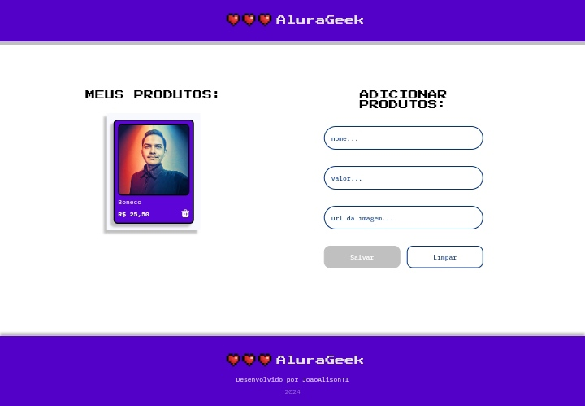

<h1 align="center"> Challenge AluraGeek </h1>

Neste desafio foi desenvolvido uma aplicação para simular um e-commerce AluraGeek, com as seguintes funções: listar, cadastrar e deletar produtos.

## Tecnologias utilizadas durante o curso
* HTML
* CSS
* Javascript
* Json-server
  
## Screenshots
